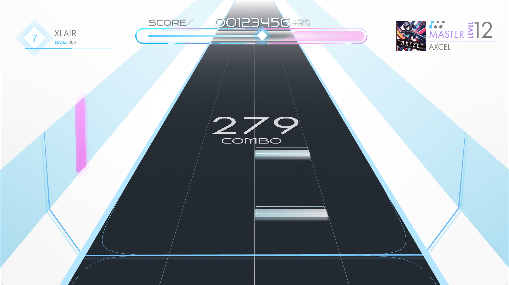
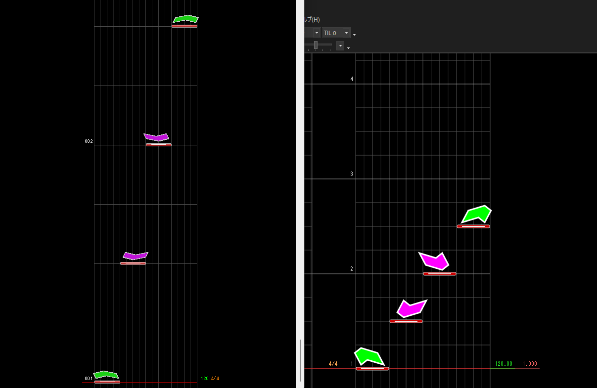
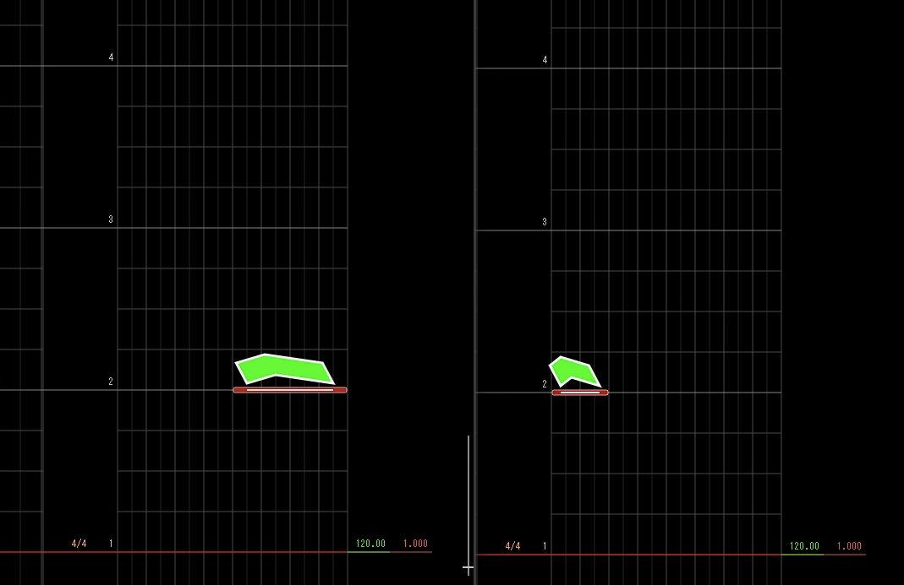
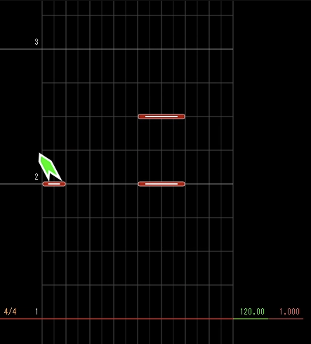
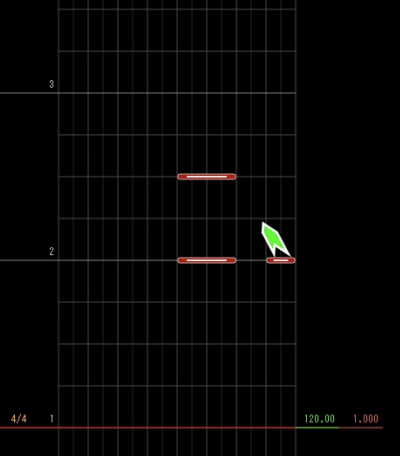
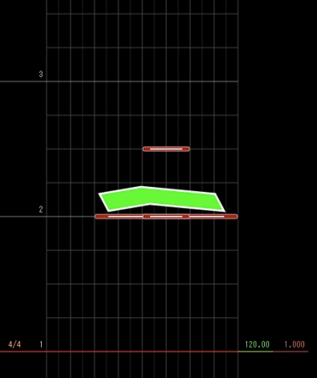
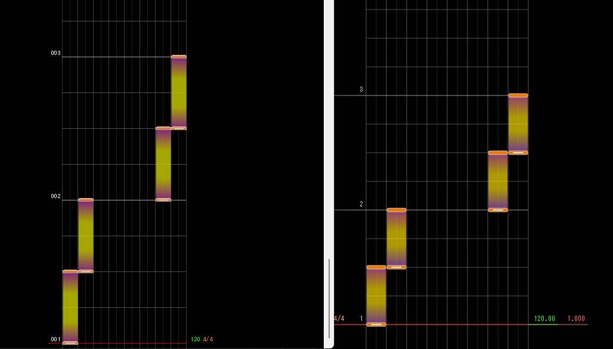
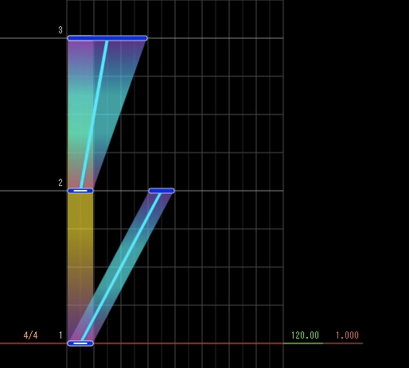

譜面作成には、以下のツールが対応しています。

- [Margrete](https://umgr.inonote.jp/margrete/intro)（[ダウンロード](https://umgr.inonote.jp/docs/releases)）
- [M4ple Editor](https://github.com/TinyTany/M4ple-Editor)
- [Ched](https://github.com/paralleltree/Ched)

Wikiが充実しているので、Margreteがおすすめです。

各エディタはXLAIR専用ではないため、後述するサイドボタンなどのXLAIR固有ルールに従って配置する必要があります。

**各エディタの使い方は各種サイトを参照してください。**

## XLAIR 本体と対応ノーツについて

XLAIRの譜面を作成する際の注意点について説明します。

譜面作成時には人間の腕は二本しかない点に注意してください。

### サイドボタンの対応

XLAIR独自の特徴として、スライダーの左右に2つずつ、計4つのサイドボタンがあります。
位置関係は以下の通りです。

```text
左 (上)                           右 (上)
左 (下)                           右 (下)
         スライダー (16 レーン)
```

プレイ画面は以下のような見た目です。



譜面作成の際は、XLAIR 独自のサイドボタンを積極的に用いていただけると嬉しいです。

### 非対応のノーツ

AIR関連のノーツについては XLAIR にはエアーに関するセンサーはないため対応していません。
また、ダメージノーツ、装飾に用いるノーツについても対応していません。

## サイドボタンのノーツの配置方法

### サイドタップノーツ

通常のサイドタップノーツにはAIRノーツを使います。

XLAIR との対応は以下の通りです。

| エディタ | XLAIR       |
| -------- | ----------- |
| AIR 左上 | サイド 左上 |
| AIR 右上 | サイド 右上 |
| AIR 左下 | サイド 左下 |
| AIR 右下 | サイド 右下 |

エディタでの配置の例を以下に示します。
この例では、1/2 拍子ごとに、左上、左下、右下、右上の順にサイドタップが流れます。



なお、AIR の方向のみに依存し、エディタ上でのノーツ幅は考慮されません。

> [!WARNING]
> エディタでは他のノーツに重ねる形でしかAIRの方向ノーツを配置できません。
> XLAIRでは、タップノーツに重なったAIRの方向ノーツがあった場合、下のタップノーツは無視されます。
> つまり、先程の図ではサイドノーツのみ配置され、中央のスライダーにはノーツは配置されません。

サイドタップノーツについて、AIRの方向のみで決定されるため、ノーツの幅および位置は関係ありません。
そのため、以下の画像に示すような配置については左右で同一のものとなります。



つまり、[先ほどのプレイ画面イメージ](#サイドボタンの対応) に対応するエディタ上での配置は以下の通りです。
配置1,2,3のいずれも同じ配置に対応します。

| 配置1                   | 配置2                   | 配置3                   |
| ----------------------- | ----------------------- | ----------------------- |
|  |  |  |

### サイドホールドノーツ

サイドボタンでのホールドは、ホールドノーツを使用します。

XLAIR との対応は以下の通りです。

| エディタ                 | XLAIR       |
| ------------------------ | ----------- |
| ホールド（レーン1 - 2)   | サイド 左上 |
| ホールド（レーン3 - 4)   | サイド 左下 |
| ホールド（レーン15 - 16) | サイド 右下 |
| ホールド（レーン13 - 14) | サイド 右上 |

エディタでの配置の例を以下に示します。
この例では、1/2 拍子ごとに、左上、左下、右下、右上の順にサイドホールドが流れます。



> [!NOTE]
> 通常のスライダーでのホールド（長押し）は、エディタ上では青のスライド用のもので代用してください。

ホールドノーツと、青のスライドノーツは重ねることができるので、サイドボタンホールドと左2列ホールドを同時に行いたい時などは重ねて配置してください。


